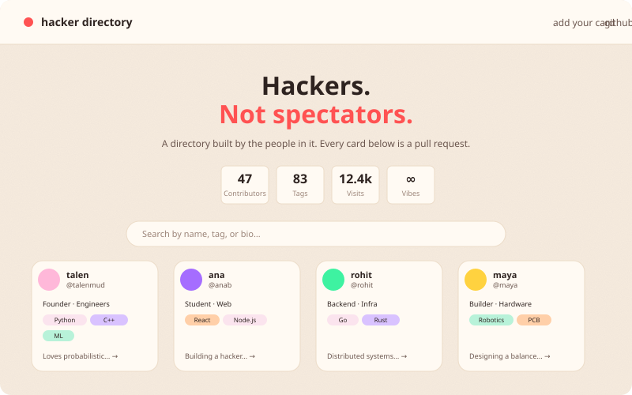
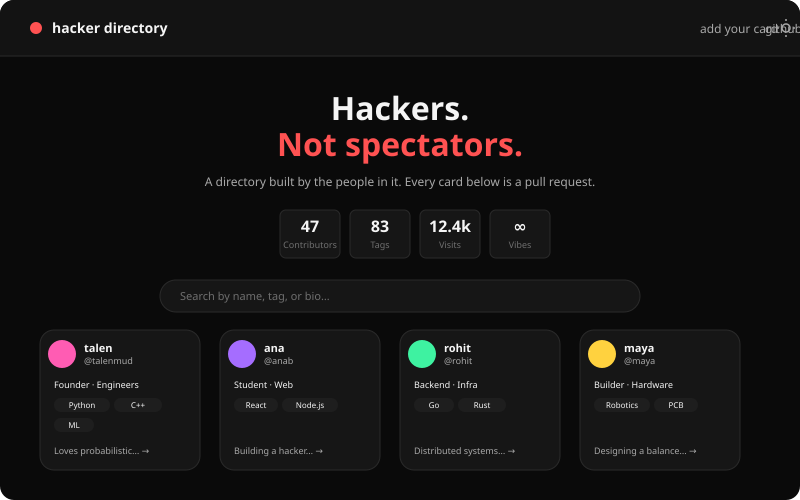
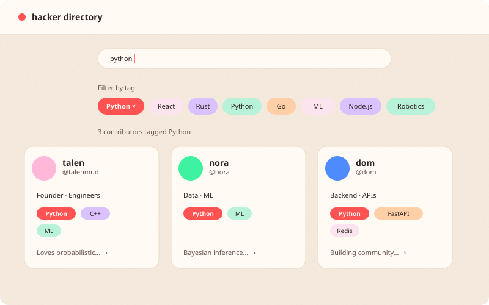
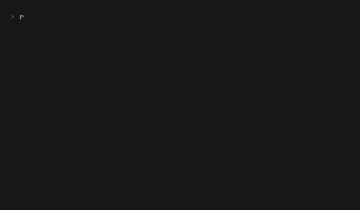

# hacker directory

**🔗 Live site: [talenmud.github.io/hacker-directory](https://talenmud.github.io/hacker-directory)**

A directory of hackers, students, and builders — where every entry is a
pull request. No sign-up form, no database, no admin panel. You fork the
repo, add a folder with your name on it, and your card shows up on the
grid.

<p align="center">
  
</p>

⭐ **If this is the kind of project you'd like to see more of, drop a star — it helps other first-timers find it.**

Each contributor gets:

- **A card** on the main directory grid — name, role, tags, bio, a link
  to their page.
- **A personal page** (`contributors/your-username/index.html`) that's
  entirely theirs to customise — bio, projects, links, or full-on
  interactive builds like the [live MCMC sampler visualisation](contributors/talen/index.html)
  on Talen's page.

It's less "university project directory" and more "developer social feed
you can hack on."

<br />

<div align="center">
  <a href="CONTRIBUTING.md">
    <strong>➕ Add your card →</strong>
  </a>
</div>

<br />

## What it looks like

Responsive grid, dark mode that follows your system preference (with a
manual override), and tag filters that update the URL so you can share a
filtered view.

<p align="center">
  
  &nbsp;
  
</p>

### Search and tag filters

Search by name, tag, or bio. Click any tag pill to narrow the grid.

<p align="center">
  
</p>

## Getting started

Adding your card is one fork, one folder, one JSON file, one pull
request. The full walkthrough lives in [CONTRIBUTING.md](CONTRIBUTING.md)
— the tape below shows the happy path in ~30 seconds:

<p align="center">
  
</p>

The tape itself is scripted at
[`.github/tapes/contribute.tape`](.github/tapes/contribute.tape) — edit
it and re-run `vhs .github/tapes/contribute.tape` if the steps ever
change.

## How it works

```
contributors/
  talen/
    index.html    ← personal page, fully customisable
    card.json     ← name, bio, github, role, tags, links
  your-username/
    ...
  manifest.json   ← list of contributor usernames
  people.json     ← generated: all card.json files bundled into one array
```

The homepage (`index.html`) fetches `contributors/people.json` — a single
bundled file containing every contributor's card data — and builds the grid
dynamically. No build step runs in the browser, no framework; still just
static files GitHub Pages can serve as-is.

`people.json` itself is generated automatically: a GitHub Action
(`.github/workflows/people-sync.yml`) runs `.github/scripts/build-people.js`
whenever `manifest.json` finishes syncing, reads every contributor's
`card.json`, and commits the combined file back to the repo. Contributors
never edit `people.json` directly — it's always derived from the individual
`card.json` files.

Every PR gets automatically checked (valid `card.json`, correct folder
scope, a quick flagged-content/image scan) by a GitHub Action — see
[`.github/workflows/pr-check.yml`](https://github.com/TalenMud/hacker-directory/blob/main/.github/workflows/pr-check.yml).
Merging itself is manual: a maintainer reviews and merges each PR by
hand rather than auto-merging.

## Contributing

Never made a pull request before? That's exactly who
[CONTRIBUTING.md](CONTRIBUTING.md) is written for. Full walkthrough, no
assumed knowledge, screenshots described step by step.

## Local development

```bash
git clone https://github.com/TalenMud/hacker-directory.git
cd hacker-directory
python3 -m http.server 8000
```

Then open `http://localhost:8000`.

## License

[MIT](LICENSE)
